# PxlPop
## Intro
Hogeschool PXL organiseert een festival! Om dit extra in de verf te zetten werd aan PXL Digital gevraagd om hiervoor een mobiele applicatie te ontwikkelen.

## Opdracht
Bouw de onderstaande vensters zo goed mogelijk na. **Lees eerst aandachtig alle instructies!**

## Design
### Fonts
- Alle teksten hebben het lettertype Arial
- Alle titels hebben het lettertype "Helvetica Neue Bold Extended"
- Bepaalde views zoals *navigatieknoppen* gebruiken hetzelfde lettertype als titels

### Colors
- Black: #030203
- White: #FFFFFF
- Primary: #58A518 (PXL Groen)

### Images
- Alle afbeeldingen die gebruikt moeten worden vind je in de assets folder in deze repository

### Icons
- De gebruikte icons in onderstaande designs komen uit de [FontAwesome (solid)](https://fontawesome.com/search?s=solid&f=classic&o=r) bibliotheek.
> Tip: Maak gebruik van het [MauiIcons](https://github.com/AathifMahir/MauiIcons) nuget package ([Install and use a package (Visual Studio)](https://learn.microsoft.com/en-us/nuget/quickstart/install-and-use-a-package-in-visual-studio))

### Light mode
<figure>
	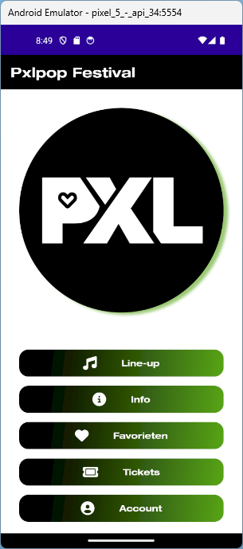
	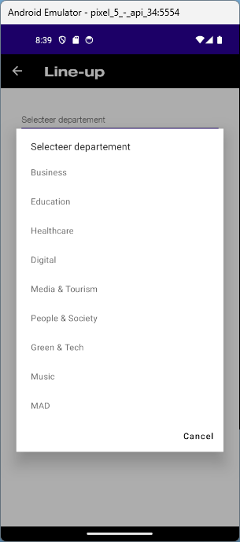
	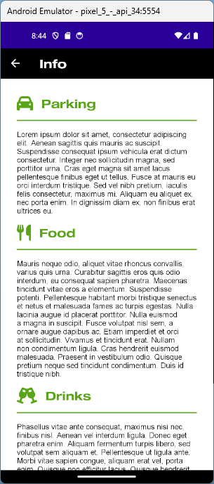
	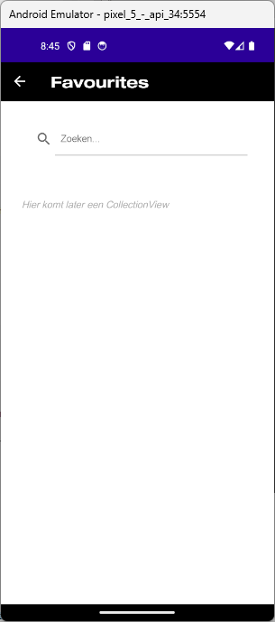
	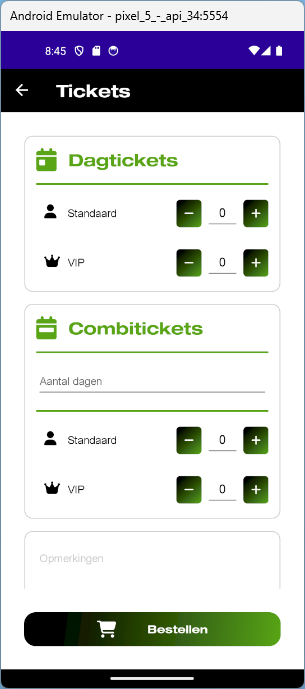
	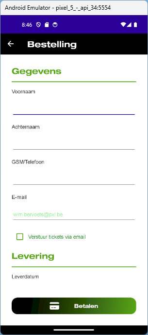
	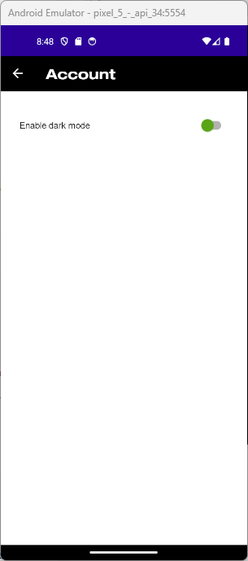
</figure>

### Dark mode
<figure>
	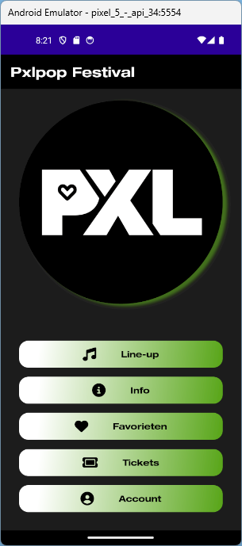
	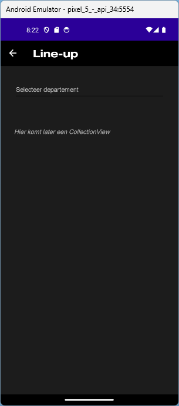
	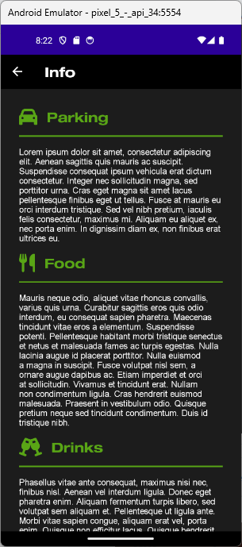
	
	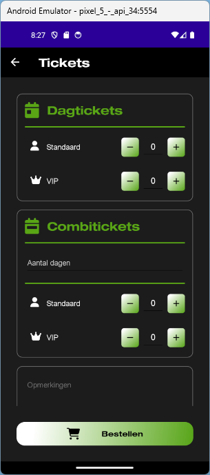
	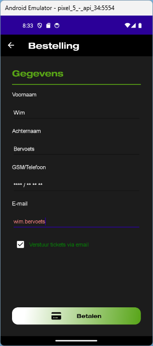
	
	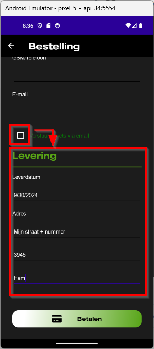
	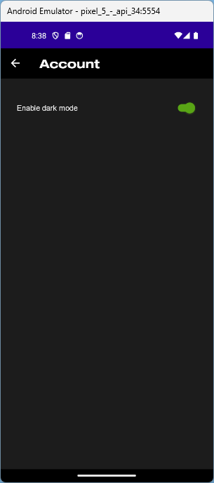
</figure>

## Pages
- MainPage
- Pages/AccountPage
- Pages/FavouritesPage
- Pages/InfoPage
- Pages/LineupPage
- Pages/OrderPage
- Pages/TicketPage

### MainPage
- Afbeelding met [Shadow](https://learn.microsoft.com/en-us/dotnet/maui/user-interface/shadow?view=net-maui-8.0) effect in de *Primary* kleur
- Buttons voor navigatie naar diverse *pages* met een algemene stijl *NavigationButtonStyle*:
	- De achtergrond is [linear gradient](https://learn.microsoft.com/en-us/dotnet/maui/user-interface/brushes/lineargradient?view=net-maui-8.0)
	- Het lettertype is "Helvetica..."
	- De hoeken zijn afgerond met waarde 15
	- De contentlayout eigenschap heeft een waarde van "Left, 40"
	- De witruimte binnen het element is 14,10
	- De tekstkleur is afhankelijk van het thema *White* of *Black* (zie [colors](#colors))

### AccountPage
- Gebruik een gepaste layout met een *Label* en een *Switch*
- Gebruik het *Toggled* event van de *switch* om te wisselen tussen *Light* en *Dark* mode, gebruik hiervoor de functie *Application.Current.UserAppTheme*
- Gebruik het *Appearing* event van de *ContentPage* om de default waarde van de *switch* te bepalen 
> *Later zullen we hier een TableView implementeren*

### FavouritesPage
- Gebruik een layout om een *SearchBar* toe te voegen
- Zorg dat de gebruiken kan scrollen door de inhoud maar dat de *SearchBar* altijd zichtbaar is
- Gebruik de kleur *Gray300* uit de resources als tekstkleur voor het *Label*

### InfoPage
- De gebruiker kan scrollen door de volledige inhoud
- De labels die een titel weergeven hebben een aparte stijl *TitleLabelStyle*:
	- Lettertype "Helvetica..."
	- Tekstkleur *Primary*
	- Lettergrootte 22
- Gebruik een *BoxView* om een horizontale lijn toe te voegen

### LineupPage
- Gebruik een *Picker* waarmee één van de departementen van Hogeschool PXL gekozen kan worden
> In een latere fase zal deze gebruikt worden om data te filteren

### TicketPage
- Gebruik een *Border* om de secties "Dagtickets" en "Combitickets" een rand te geven, wijzig de algemene stijl voor *Borders* zodat:
	- De hoeken worden afgerond met een waarde van 10 
	- Het element een witruimte heeft van 15 binnen het element
- Gebruik een *Picker* om het aantal dagen te selecteren (2 of 3)
- Gebruik onderaan een *Editor* om de gebruiker eventuele opmerkingen te laten ingeven
- Maak als resource van de *ContentPage* 2 stijlen aan: QuantityButtonStyle + QuantityEntryStyle
	- Gebruik de standaard stijl voor *Buttons* als basis
	- Gebruik deze stijlen om de maximale breedte en hoogte in te stellen
- Gebruik icons voor het plus- en minteken van de *"QuantityButtons"*
- Het aantal wordt per type getoond in een *Entry* view
- De knop *Bestellen* navigeert naar de *OrderPage*

#### OrderPage
- Gebruik de [EmailValidationBehavior](https://learn.microsoft.com/en-us/dotnet/communitytoolkit/maui/behaviors/email-validation-behavior) om het email adres te valideren
- Wanneer de *CheckBox* "Verstuur tickets via email" wordt aangevinkt wordt het gedeelte "Levering" onzichtbaar gemaakt
- Gebruik een *DatePicker* om de gewenste leverdatum te selecteren, de minimum datum is "vandaag + 3 dagen"
- De knop *Betalen* navigeert naar de *MainPage* met `await Shell.Current.GoToAsync("//MainPage", true);`

## Bronnen
- [MauiIcons](https://github.com/AathifMahir/MauiIcons)
- [EmailValidationBehavior](https://learn.microsoft.com/en-us/dotnet/communitytoolkit/maui/behaviors/email-validation-behavior)
- [MAUI Controls & Views](https://learn.microsoft.com/en-us/dotnet/maui/user-interface/controls/?view=net-maui-8.0)
- [Shadows](https://learn.microsoft.com/en-us/dotnet/maui/user-interface/shadow?view=net-maui-8.0)
- [Gradients](https://learn.microsoft.com/en-us/dotnet/maui/user-interface/brushes/lineargradient?view=net-maui-8.0)